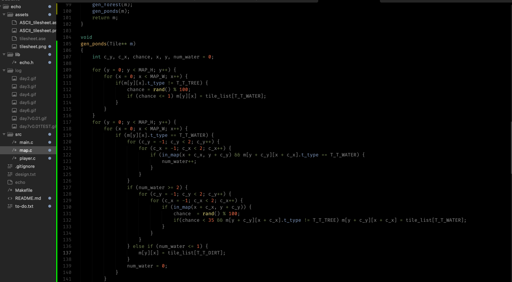

# echo

\~\~LOG\~\~

### V 0.01 - DONE

23/10/24 - Day 1: Set-up project, player moving

24/10/24 - Day 2: map generation and tile loading system

25/10/24 - Day 3: Added tree tiles, forest gen system

26/10/24 - Day 4: New (better?) forest gen, grass around forest, added water tile (no placement)

28/10/24 - Day 5: Added player FoV (3x3 grid, visible+seen tiles)

31/10/24 - Day 6: Improved player FoV - circular raycasting + bresenham's line (used Claude)

01/11/24 - Day 7 (V0.01): Added player move collision, diagonal movement, water feature ('pond') generation

05/11/24 - Day 8: Planned V0.02, tweaked player FoV (less sight in grass), changed visuals